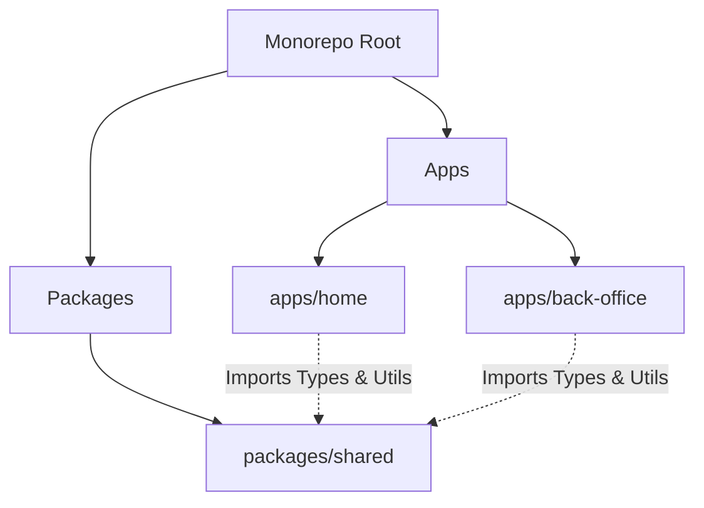
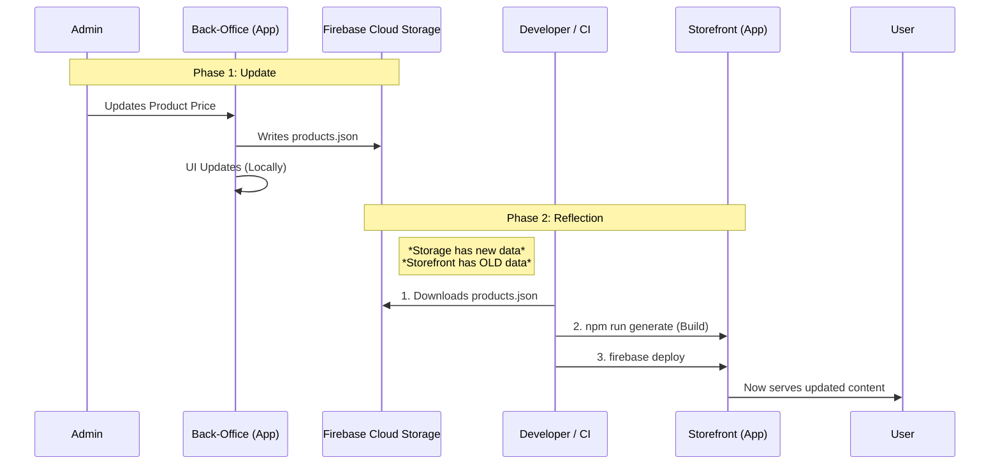
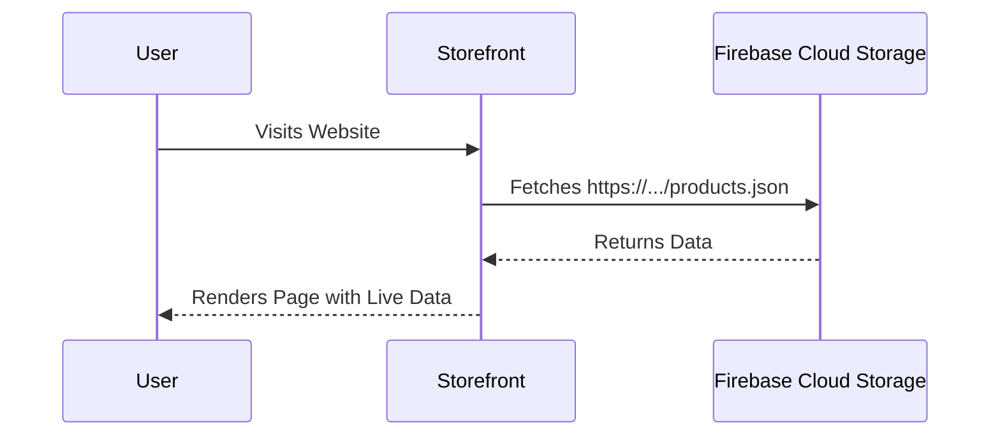

# System Architecture & Data Flow

This document outlines the architecture of the Cruzar Deportes monorepo and how data flows between the Back-Office, Firebase Storage, and the Storefront.

## 🏗️ High-Level Architecture

The system is organized as a **Monorepo** containing two main applications and shared packages:



## 🔄 Data Lifecycle & Updates

The product data (`products.json`) is the central source of truth. It is managed by the Back-Office and stored in the cloud, then consumed by the Storefront.

### Current Flow (Static Generation)

1.  **Edit**: Admin updates a product in the Back-Office.
2.  **Save**: Back-Office writes the updated JSON to **Firebase Cloud Storage**.
3.  **Deploy**: Storefront must be **rebuilt** to include the new JSON.



### Implications
*   **Back-Office**: Reflects changes immediately because it reads directly from Cloud Storage or Local cache.
*   **Storefront**: Reflects changes **only after a redeployment**. This ensures maximum performance (no API calls for data) but requires a build step for updates.

## 🚀 Deployment Strategy

### Firebase Project Structure
All applications now exist under a single Firebase project (`deportes-cruzar`).
*   **Hosting Target**: `storefront` -> `apps/home`
*   **Hosting Target**: `admin` -> `apps/back-office`

### Recommended Workflow
To publish changes made in the Back-Office to the public Storefront:

1.  **Verify Data**: Check the Back-Office to ensure all products look correct.
2.  **Trigger Deploy**:
    ```bash
    # From project root
    npm run deploy:storefront
    # (Assuming a script exists to download json + build + deploy)
    ```

    *If doing it manually:*
    ```bash
    # 1. Download latest data (if not using shared/scripts yet)
    # 2. Build and Deploy
    cd apps/home
    npm run firebase:build-deploy
    ```

## 🔧 Deployment Workflow (Step-by-Step)

### When admin makes changes in back-office:

1. **Admin edits products** → Changes saved to Firebase Storage automatically ✅
2. **Run deployment workflow** → Execute from project root:
   ```bash
   npm run sync
   # or
   bash packages/shared/scripts/deploy-home.sh
   ```
3. **Verify deployment** → Check live site for updated products

### For local development:

To pull latest products without deploying:
```bash
npm run sync:data
cd apps/home
npm run dev
```

### Available npm scripts:

| Command | Description |
|---------|-------------|
| `npm run sync` | Complete deployment workflow (sync + build + deploy) |
| `npm run sync:data` | Download latest products.json only (for local dev) |
| `npm run deploy:storefront` | Deploy only (without syncing data) |
| `npm run deploy:storefront:full` | Same as `npm run sync` |

### Understanding the Sync Process

The `deploy-home.sh` script performs these steps:
1. **Bootstrap Storage** - Syncs products.json from Firebase Storage
2. **Rebuild Catalog** - Ensures all team products are present
3. **Copy to Storefront** - Updates apps/home with latest data
4. **Build** - Generates static HTML with updated products
5. **Deploy** - Uploads to Firebase Hosting

**Important**: Always run `npm run sync` after making changes in the back-office to ensure the storefront reflects the latest data.

---

## 🔌 Future Improvements: Runtime Fetching

To avoid rebuilding for every price change, we can switch the Storefront to **Runtime Fetching**:



**Pros**: Instant updates.
**Cons**: Small network delay on initial load.
